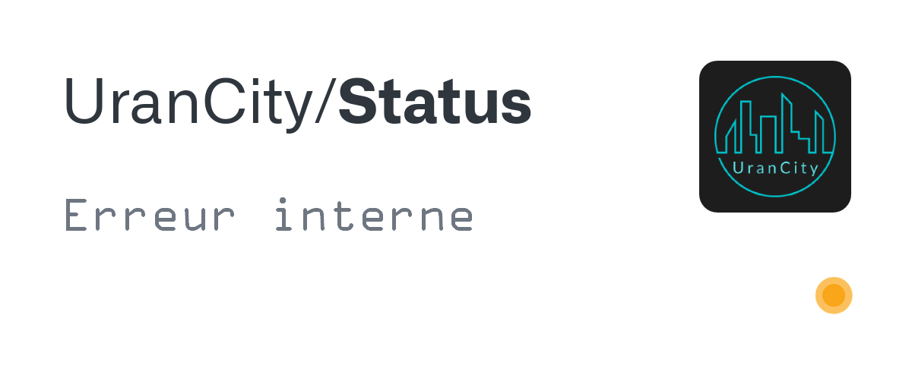

	
	<h1 align="center"> Statut Page d'UranCity </h1>

 
	<a href="https://workers.cloudflare.com/">
     
	

## Description

> **[UranCity/Status](https://github.com/UranCity/Status)** est un système, fonctionnant grâce à [Cloudflare Workers®](https://workers.cloudflare.com/), permettant de rediriger une requête [HTTP](https://developer.mozilla.org/fr/docs/Web/HTTP), envoyé à [status.urancity.ml](https://status.urancity.ml), vers une image selon le status actuel du serveur grâce à l'[API de Minecraft Server Status](https://api.mcsrvstat.us/).

## Statut

| État               | Aperçu                                      |
| ------------------ | ------------------------------------------- |
| **En ligne**       |        |
| **Hors-ligne**     |        |
| **Erreur interne** |  |

## Crédit

- [GitHub](https://github.com)
- [Cloudflare Workers®](https://workers.cloudflare.com/)
- [Minecraft Server Status API](https://api.mcsrvstat.us/)
